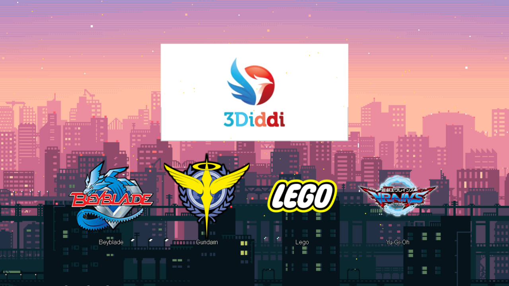

# 中学Project —— 玩具网页
- 由我与另外四人做成的东西，经过了日积夜累的搬迁和架设，很多东西已经破烂不堪。
- 修复网页的任务主要是我负责，并且重新整理所有的网页链接，以及学会一大堆的优化。
- 用2023年学到的网页知识，去试图修复2017年的网页。 我想，这是一种负责吧。

# 所使用的各种插件：
### CSS
- reset —— 把html默认的配置全部归0，重0开始写起。
- bootstrap5 —— 主要练习排版设计的好东西
- font-awesome 4.7.0 —— 当时做的时候就用这个版本，我知道最新版已经到6代了。  ~~我就懒得升级怎样？~~

### JS
- JQuery —— 核心JS，也是我目前最喜欢用的框架（或者说，最熟悉的）
- firefly.js —— 萤火虫特效，会变卡但就是好看啊 awa （这东西需要JQuery支援）

# 主要内容：
这简单的网页主要分成五个部分：
- index —— 萤火虫，会呼吸的banner，四颗按钮，学会怎么把整个内容置中
- beyblade —— *损坏，正在尝试寻找更旧的档案中*
- gundam —— 用了类似个人部落格的风格来设计
- lego —— 用了parallax的形式来设计，并且\<embed\> youtube的功能
- yu-gi-oh —— 用了pdf阅读器 + 幻灯片（caroussel）的功能

# 目前进度：
- Index：修复完成
- Beyblade：档案丢失，正在寻找更旧的备份中
- Gundam：修复完成
- Lego：修复完成
- Yu-Gi-Oh：修复完成
